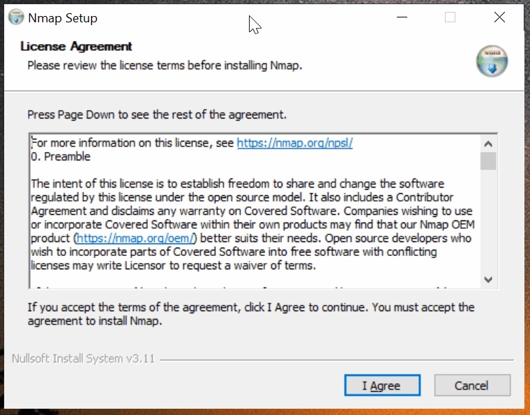
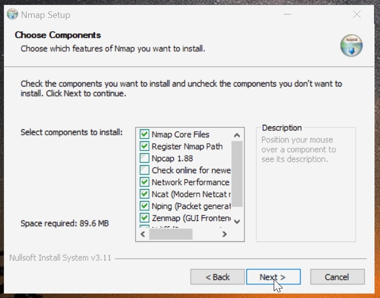
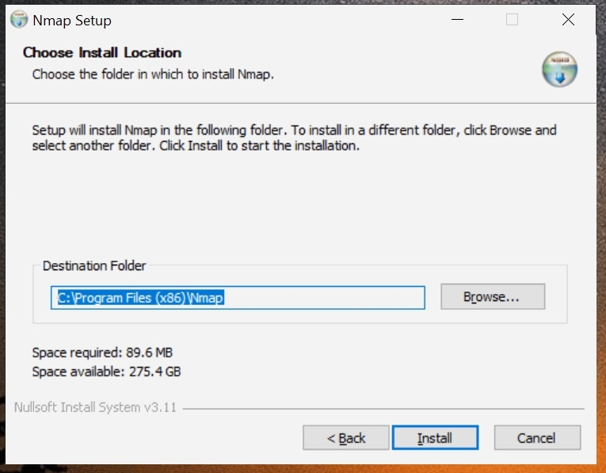
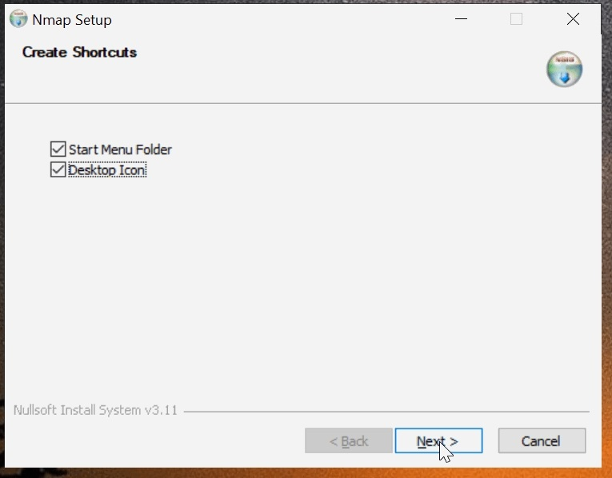
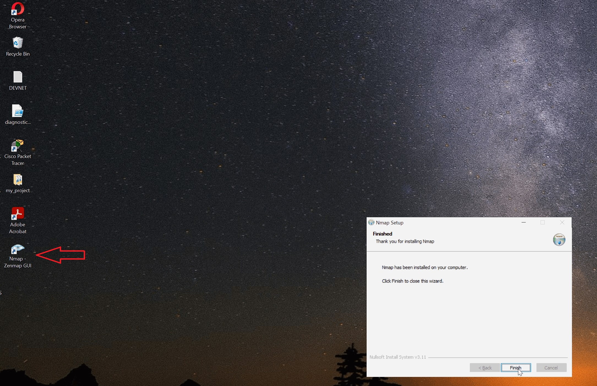
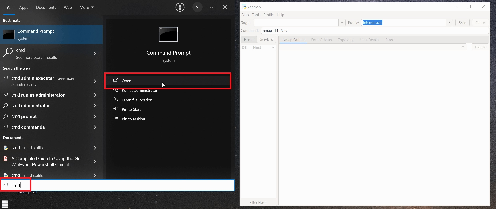
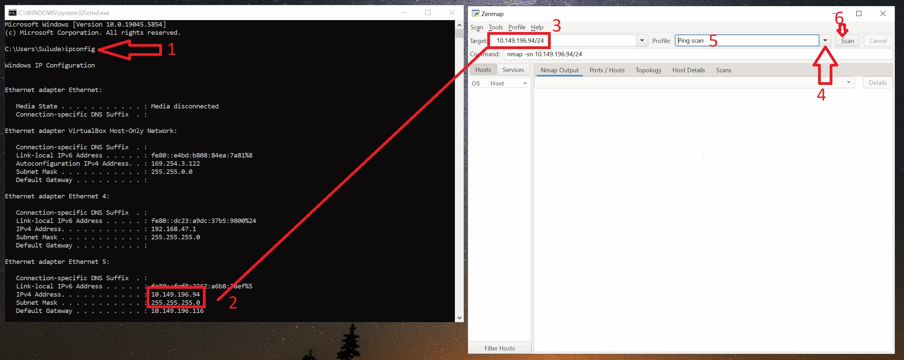
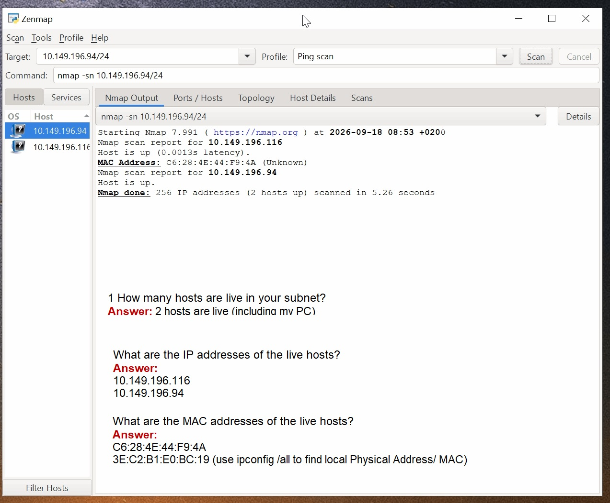
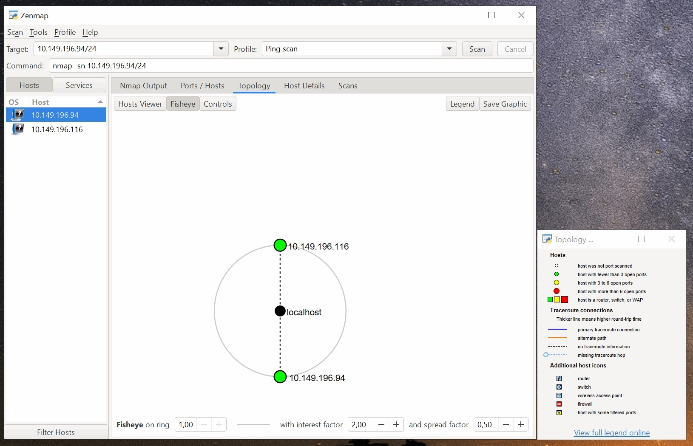
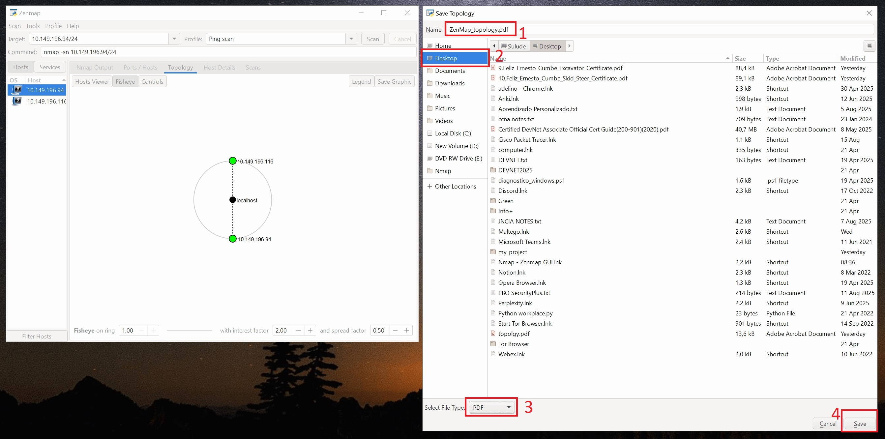

# NETWORKWALKS-EMMANUEL-B083-WK2-PM5-ZENMAP-NETWORK-SCANNING
Week 2 — Project Module 5: Network Scanning with Zenmap.
# 🧪 CyberLab — Week 2 | Module 5: Network Scanning with Zenmap

## 🎯 Objective

Perform network discovery and host identification using Zenmap to identify live devices, IP addresses, MAC addresses, and visualize the discovered network topology.

---

## 🗺️ Network Scanning Tasks

### 1. Install Zenmap

**Objective:**  
Download and install Zenmap on the Windows PC.

**Status:** ✅ Completed

📸 **Evidence:** Zenmap installation / main interface screenshot.





---

### 2. Identify Local IP & LAN Subnet

**Objective:**  
Identify the local IP address and LAN subnet before performing network discovery.

**Local IP Address:**



```text
Local iP: 10.149.196.94
```

**LAN Subnet:**

```text
255.255.255.255.0
```

📸 **Evidence:** Local IP and subnet configuration screenshot.


---

### 3. Discover Live Hosts

**Objective:**  
Scan the local subnet to identify live hosts/PCs.

**Target:**

```text
10.149.196.94/24
```

**Summary:**  
Zenmap was used to discover active hosts within the local subnet.

📸 **Evidence:** Zenmap host discovery results.

---

### 4. Number of Live Hosts

**Total live hosts identified:**

```text
2
```

📸 **Evidence:** Zenmap scan results showing the discovered hosts.

---

### 5. IP Addresses of Live Hosts

The following IP addresses were identified during the network scan:

| No. | IP Address |
|---:|---|
| 1 | `[10.149.196.94]` |
| 2 | `[10.149.196.116]` |

📸 **Evidence:** Zenmap host list.

---

### 6. MAC Addresses of Live Hosts

The MAC addresses identified during the scan were documented as follows:

| No. | IP Address | MAC Address |
|---:|---|---|
| 1 | `[10.149.196.94]` | `[C6:28:4E:44:F9:4A]` |
| 2 | `[10.149.196.116]` | `[3E-C2-B1-E0-BC-19]` |

📸 **Evidence:** Zenmap scan results showing MAC addresses.

---

### 7. Network Topology

📸 **Evidence:** Zenmap topology screenshot.



### 7. Network Topology

The Zenmap network topology was generated and saved in PDF format.

📄 **Output:** (screenshots/ZenMap_topology.pdf)
---

## 💡 Key Takeaways

This module provided practical experience with network discovery using Zenmap.

The exercise demonstrated how a network scanner can be used to identify active hosts, IP addresses, MAC addresses, and visualize discovered network devices through a topology.

---

## 🔐 Ethical Use

This project was completed as part of the **Networkwalks Cybersecurity Internship Program** for educational purposes.

Network scanning should only be performed against networks and systems where appropriate authorization has been granted.

---

## 🛠️ Tools Used

`Zenmap` · `Nmap` · `Windows`

---

## 👤 Author

**Adelino Sulude**

This project was completed as part of the **Networkwalks Cybersecurity Internship Program**.

All practical scanning, analysis, evidence collection, and documentation in this repository were performed by **Adelino Sulude**.

**Focus:** Network & Infrastructure | Cybersecurity

---

## 🙏 Training & Credits

This project was developed based on the practical exercises and training provided through the **Networkwalks Cybersecurity Internship Program**.

**Training Instructor:**  
**Waqas Karim — CCIE**

The internship provided the learning material, project requirements, and practical exercises used as the basis for this work.

---

## 📌 Module Status

**Week 2 — Project Module 5: Completed ✅**
